# EventHub — Entity Relationship Diagram

> **Graded deliverable** (part of Rubric 2). This ERD reflects the **implemented** core-api migrations
> (`services/core-api/database/migrations`) as of the latest schema — including the `2026_06_30_*` additions
> (`order_items.original_price`, `sales_reports.total_discount`, `payouts.paid_at`). Renders on GitHub/GitLab and in
> Mermaid Live. (payment-service keeps its own `payments`/`idempotency_keys` tables in its own DB; this diagram is the
> core-api domain schema.)

## ER diagram (Mermaid)

> **All primary keys are ULIDs** (Laravel `HasUlids`); foreign keys use `foreignUlid`. Non-enumerable across tenants
> and time-sortable for index locality — see ADR-19. (`ulid`/`bigint` here are logical types; ULIDs are stored as
> 26-char strings / `char(26)`.)

```mermaid
erDiagram
    users ||--o| vendors : "has profile"
    users ||--o| attendees : "has profile"
    vendors ||--o{ events : organizes
    events ||--o{ ticket_types : has
    ticket_types ||--o{ ticket_holds : "reserved by"
    ticket_types ||--o{ tickets : "issued as"
    ticket_types ||--o{ order_items : "purchased in"
    attendees ||--o{ orders : places
    orders ||--o{ order_items : contains
    order_items ||--o{ tickets : "issues N"
    orders ||--o{ ticket_holds : holds
    orders ||--o{ payments : "charged via (retries)"
    payments ||--o{ refunds : "refunded by"
    orders ||--o{ tickets : issues
    orders ||--o{ disputes : "may raise"
    refunds ||--o| disputes : "may resolve"
    vendors ||--o{ payouts : "settled via"
    payouts ||--o{ payout_items : "settles"
    orders ||--o{ payout_items : "settled in"
    vendors ||--o{ ledger_entries : "balance derived from"
    vendors ||--o{ kyc_documents : submits
    users ||--o{ vendors : "reviews KYC (admin)"
    users ||--o{ disputes : "resolves (admin)"
    users ||--o{ tickets : "checks in (staff)"
    vendors ||--o{ sales_reports : "reported in"
    events ||--o{ waitlist_entries : "waitlisted on"
    events ||--o{ event_reminders : "reminders tracked"
    attendees ||--o{ waitlist_entries : joins

    users {
        ulid id PK
        string name
        string email UK
        string password
        enum role "admin|vendor|attendee"
        timestamp created_at
        timestamp deleted_at "soft delete"
    }
    vendors {
        ulid id PK
        ulid user_id FK
        string business_name
        string legal_name
        string trade_license_no
        string tin_bin "encrypted"
        string representative_nid "encrypted"
        string contact_phone
        string address
        enum kyc_status "pending|verified|rejected"
        timestamp submitted_at "nullable"
        ulid reviewed_by FK "admin user_id, nullable"
        timestamp reviewed_at "nullable"
        string rejection_reason "nullable"
        json payout_account "[PLACEHOLDER] encrypted"
        string webhook_url "nullable"
        string webhook_secret "per-vendor HMAC, encrypted"
        decimal commission_rate "nullable override"
        timestamp deleted_at
    }
    kyc_documents {
        ulid id PK
        ulid vendor_id FK
        enum type "trade_license|nid|bank_statement"
        string storage_path "encrypted; signed-URL access"
        enum status "pending|verified|rejected"
        timestamp uploaded_at
        timestamp deleted_at
    }
    attendees {
        ulid id PK
        ulid user_id FK
        string phone "nullable"
        timestamp deleted_at
    }
    events {
        ulid id PK
        ulid vendor_id FK
        string title
        text description
        string timezone "IANA"
        timestamp starts_at "UTC"
        timestamp ends_at "UTC"
        int capacity "hard ceiling; sum(ticket_types.quantity_total) <= capacity"
        enum status "draft|published|ongoing|completed|cancelled"
        timestamp deleted_at
    }
    ticket_types {
        ulid id PK
        ulid event_id FK
        enum kind "early_bird|vip|general"
        bigint price "minor units, per unit"
        string currency "ISO 4217"
        int quantity_total
        int quantity_sold "denormalized counter"
        int group_size "nullable, N units per bundle"
        decimal group_discount "nullable, fraction off N units"
        timestamp sales_start
        timestamp sales_end
        timestamp deleted_at
    }
    orders {
        ulid id PK
        ulid attendee_id FK
        enum status "pending|paid|expired|failed|cancelled|refunded|partially_refunded"
        bigint total "minor units"
        string currency
        decimal commission_rate "snapshot at sale time"
        string idempotency_key UK
        timestamp created_at
    }
    order_items {
        ulid id PK
        ulid order_id FK
        ulid ticket_type_id FK
        int quantity
        bigint unit_price "minor units, locked at hold creation (post group-discount)"
        bigint original_price "per-unit price BEFORE group discount (minor units)"
    }
    ticket_holds {
        ulid id PK
        ulid order_id FK
        ulid ticket_type_id FK
        int quantity
        enum status "active|released|converted"
        timestamp expires_at "indexed"
    }
    tickets {
        ulid id PK
        ulid order_id FK
        ulid order_item_id FK
        ulid ticket_type_id FK
        string qr_code UK
        enum status "valid|checked_in|transferred|refunded"
        timestamp checked_in_at "nullable"
        ulid checked_in_by FK "admin/staff user_id, nullable"
    }
    payments {
        ulid id PK
        ulid order_id FK
        string gateway "stripe_sim|paypal_sim"
        enum status "pending|succeeded|failed"
        string external_ref "[PLACEHOLDER]"
        string idempotency_key UK "per charge attempt"
        bigint amount "minor units"
        string currency
    }
    refunds {
        ulid id PK
        ulid payment_id FK
        bigint amount "minor units, auto-derived (policy% x base)"
        string policy_applied "100|50|0"
        enum status "requested|pending|completed|failed"
        string reason "attendee_requested|event_cancelled"
    }
    payouts {
        ulid id PK
        ulid vendor_id FK
        bigint gross "minor units — SUM of sale entries"
        bigint commission "absolute value of commission entries"
        bigint net "gross - commission (signed; may be negative)"
        bigint payable "net + adjustments, floored at 0; amount sent to payment-service"
        bigint reserved_refund "minor units, reserved vs in-window refunds"
        string currency "ISO 4217"
        enum status "pending|approved|processing|paid|failed"
        string batch_id
        timestamp paid_at "nullable; set on webhook-confirmed payout"
        string idempotency_key UK
    }
    payout_items {
        ulid id PK
        ulid payout_id FK
        ulid order_id FK
        bigint settled_amount "minor units"
        timestamp settled_at "nullable; set on webhook success (null = not yet settled)"
    }
    disputes {
        ulid id PK
        ulid order_id FK
        ulid refund_id FK "nullable, resolution refund"
        string reason
        enum status "open|resolved|rejected"
        ulid resolved_by FK "admin user_id, nullable"
        text resolution "nullable"
    }
    waitlist_entries {
        ulid id PK
        ulid event_id FK
        ulid ticket_type_id FK
        ulid attendee_id FK
        int position
        enum status "waiting|offered|claimed|expired"
        timestamp offered_at "nullable"
        timestamp claim_expires_at "nullable, +30 min"
    }
    ledger_entries {
        ulid id PK
        ulid vendor_id FK "nullable, for balance"
        string subject_type "order|payment|refund|payout"
        ulid subject_id
        string entry_type "sale|commission|payout|refund|clawback"
        bigint amount "minor units, signed (+/-)"
        string currency
        timestamp created_at "append-only"
    }
    idempotency_keys {
        ulid id PK
        string key UK
        string request_hash
        json response_payload
        string status
        timestamp created_at
    }
    settings {
        ulid id PK
        string key UK
        string value
        enum type "int|decimal|string|bool"
        timestamp updated_at
    }
    event_reminders {
        ulid id PK
        ulid event_id FK
        enum type "24h|1h"
        timestamp sent_at
    }
    sales_reports {
        ulid id PK
        date report_date
        ulid vendor_id FK "nullable = platform-wide"
        int tickets_sold
        bigint gross "minor units"
        bigint commission "minor units"
        bigint net "minor units"
        bigint total_discount "minor units — group/bundle discount given that day"
        string currency
        timestamp created_at
    }
```

## Relationship notes

- **users 1:1 vendors / attendees.** A `user` holds auth + role; the role-specific profile lives in `vendors` or
  `attendees` (one optional profile each, matching the `role` enum). Splitting keeps role-specific columns
  (`kyc_status`, `payout_account` vs `phone`) off the shared auth row.
- **vendors 1:N events 1:N ticket_types.** A vendor owns its events; an event owns its ticket types. Ownership is
  the authorization boundary — a vendor may only mutate rows reachable through its own `vendor_id`.
- **events.capacity is a hard ceiling.** `events.capacity` caps the venue/event size independently of how it's sliced
  into ticket types. The invariant `SUM(ticket_types.quantity_total) ≤ events.capacity` is **enforced on ticket-type
  create/edit** (reject if a change would exceed it), so the sum of sellable inventory can never exceed the room.
- **ticket_holds vs tickets.** Both reference `order` and `ticket_type` but mean different things: a `ticket_hold`
  is a **transient count reservation** (15-min `expires_at`, status `active|released|converted`); a `ticket` is the
  **issued, QR-coded** artifact created **only after payment succeeds**. A hold converts to tickets on payment.
  **Availability counts only non-expired active holds** — `status = active AND expires_at > now()` — so a hold stops
  consuming inventory the moment it expires, **enforced at read time**. The `ReleaseExpiredHolds` cron is
  **housekeeping** (tidies stale rows to `released`, keeps waitlist logic simple); it is *not* the expiry source of
  truth, so correctness never depends on its cadence.
- **tickets hang off order_items.** Each `ticket` carries an `order_item_id` (plus `order_id`/`ticket_type_id` for
  convenience), so a single line — including a **group bundle** of N units — issues **N individual tickets** traceable
  to the exact line they were bought on. A ticket's `status` (`valid|checked_in|transferred|refunded`) tracks its own
  lifecycle independently of the order: e.g. one ticket of a multi-ticket order can be `checked_in` or individually
  `refunded` while the others stay `valid` (and the order becomes `partially_refunded`).
- **orders 1:N payments (retry cardinality), payments 1:N refunds.** *Decision:* an order has **many** payment
  rows, not one — a failed/declined charge can be retried, each attempt is its own `payments` row, and **at most one**
  reaches `succeeded`. This keeps every gateway attempt auditable instead of overwriting a single row, and the
  succeeded payment is the one that drives ticket issuance and the ledger. Each attempt carries its own
  `payments.idempotency_key` (the key core-api sends to the payment-service for that charge), so a retried network
  call for the **same** attempt is de-duplicated by the gateway and returns the original result, while a genuinely
  **new** attempt uses a fresh key and a new row — the unique key is what distinguishes "retry the same charge" from
  "start another charge." A succeeded payment can then be refunded in parts over time (1:N) — supporting the
  100/50/0% policy and partial/dispute refunds. Refund totals are validated against the ledger so cumulative refunded
  never exceeds the charge.
- **refund request + policy (ADR-29).** A refund is raised **against an order** (the attendee never names an amount);
  the amount is auto-derived = `policy% × selected line totals` and capped so cumulative refunds never exceed the
  charge. `refunds.reason` is the policy-driving **category** (`attendee_requested` time-banded 100/50/0% vs
  `event_cancelled` flat 100%, ADR-23), not free text; `policy_applied` snapshots the band. A refund starts
  `requested` (policy-approved, execution job queued, **no money moved, no ledger row yet**) → `pending` (executing)
  → `completed|failed` (Chunk C). Idempotency is **one open refund per order** (`requested|pending`), enforced under
  a `SELECT … FOR UPDATE` on the order row, so a duplicate request returns the existing refund — mirroring checkout.
- **vendor KYC (vendors + kyc_documents).** Identity fields (`legal_name`, `trade_license_no`, `tin_bin`,
  `representative_nid`, `contact_phone`, `address`) live on `vendors`; uploaded evidence lives in `kyc_documents`
  (1:N — a trade license, an NID, a bank statement). The verification audit (`submitted_at`, `reviewed_by` → the
  admin `user`, `reviewed_at`, `rejection_reason`) records who decided KYC and when. `reviewed_by` is a **second**
  `users → vendors` relationship (the admin reviewer), distinct from the vendor's own `user_id` profile link.
- **disputes resolution.** A `dispute` belongs to an `order`, is resolved by an admin (`resolved_by` → `users`), and
  **optionally** references the `refund` that settled it (`refund_id`, nullable — an out-of-policy contest may be
  resolved by issuing a refund, or rejected with no refund).
- **waitlist claim window.** When a freed ticket is offered, `offered_at` is stamped and `claim_expires_at =
  offered_at + 30 min`. A cron expires unclaimed offers (`status offered → expired`) and rolls the offer to the next
  `position` in line for that `ticket_type`.
- **event_reminders (idempotent cron).** One row per `(event_id, type)` marks that the `SendEventReminders` batch
  fired for that window, so re-running the cron never double-dispatches. Per-recipient delivery is tracked in the
  notification-service, not here. *Deliberate simplification:* dedupe is **per event-window, not per recipient** — the
  batch reminds the holders known when it fired; an attendee who purchases **after** the window has already run is not
  retro-reminded. Acceptable because the reminder is a courtesy, not a money path, and per-recipient tracking would
  add cost disproportionate to its value at this scope.
- **sales_reports (daily cron rollup).** Each row **aggregates `ledger_entries` by date** for a
  `(report_date, vendor_id)` pair, with `vendor_id` **nullable** to mean a **platform-wide** roll-up. `unique(report_date,
  vendor_id)` makes regeneration idempotent: re-running the cron **upserts** the same row rather than appending a
  duplicate. Because each report is a sum of *that day's* ledger rows, **a later refund reduces the net on its own
  date and never rewrites a past day's report** — corrections land on the day they happen (consistent with the
  append-only ledger), and a period total is just the ledger summed over the range, which reconciles exactly with the
  per-day rows. It is a derived read-model — the `ledger_entries` remain the source of truth; a report can always be
  recomputed from the ledger. `total_discount` aggregates the group/bundle discount given that day
  (`SUM((order_items.original_price − unit_price) × quantity)`), so the dashboard can show gross vs. discount vs. net
  without re-deriving pricing.
  - *Caveat (NULL is distinct in a MySQL unique index):* the `unique(report_date, vendor_id)` constraint does **not**
    prevent duplicate **platform-wide** rows, because every `vendor_id IS NULL` value is treated as distinct — the
    index guards vendor-scoped rows only. So `GenerateSalesReport` must dedupe the platform-wide row at the
    application layer, via `updateOrCreate` keyed on `report_date` + the `vendor_id` (or its NULL case). Net:
    **the DB unique index guards vendor-scoped rows; app logic guards the platform-wide (NULL) row.** Alternatively, a
    stored/generated `COALESCE(vendor_id, 0)` column under the unique index would let the database enforce both cases.
- **tickets check-in.** `checked_in_at` records *when* a ticket was scanned; `checked_in_by` (nullable → `users`)
  records *which* admin/staff member performed the check-in, for an accountable entry audit. Both null until scanned.
- **settings (admin-configurable platform values).** A small key/value table holding the **platform commission
  rate** and **minimum payout threshold** (admin-settable). The commission rate is read from here **at sale time** and
  snapshotted onto `orders.commission_rate`, so changing the setting never rewrites historical payout math.
- **orders → order_items.** Line items carry `quantity` and the `unit_price` **locked at hold creation**; the order's
  `total` and `commission_rate` are snapshots fixed at sale time (price quoted = price charged; payout uses the
  historical commission rate).
- **group bundles are attributes, not a table.** A bundle is `group_size` (N units) + `group_discount` on the
  `ticket_type` — a discount applied when N underlying units are bought together. There is no `group_bundle` SKU;
  inventory still decrements by the N units, and `order_items.unit_price` reflects the discounted per-unit price.
- **ledger_entries is polymorphic + append-only.** `subject_type`/`subject_id` point at the order/payment/refund/
  payout that caused the entry; `vendor_id` attributes it to a vendor for balance math; `amount` is **signed**. It is
  the financial source of truth — never updated or deleted.
- **vendor balance is derived, not stored.** There is **no mutable balance column** on `vendors`. Balance =
  `SUM(ledger_entries.amount) WHERE vendor_id = ?` (sales − commission − payouts ± clawbacks). A refund-after-payout
  writes a negative `clawback` entry, so the derived balance **can go negative** and is reconciled against the next
  payout cycle.
- **payouts amount columns.** `gross − commission = net` (signed; may be negative). `payable = net + adjustments`
  (refunds/clawbacks, typically ≤ 0), floored at 0 — this is the amount actually sent to the payment-service; below
  the minimum threshold it floors to 0 and rolls to the next cycle. `paid_at` is stamped **only** when the payout
  webhook confirms disbursement (not when the row is built or sent), so a built-but-unpaid payout is distinguishable
  from a settled one.
- **payouts → payout_items (settlement traceability).** A `payout` settles many orders; `payout_items` records the
  exact `(payout_id, order_id, settled_amount, settled_at)` for each, so every payout is **traceable to the precise
  orders it paid for** — essential for reconciliation and the clawback story (ADR-20). `settled_at` is null until the
  payout webhook confirms success (per-order settlement confirmation), and `unique(payout_id, order_id)` is a DB-level
  guard that the same order can never be double-listed in one payout. Crucially, an order's revenue is **only
  settled once its event is `completed`** (never before), and each payout carries a `reserved_refund` amount held
  against not-yet-settled orders. Settling only after the event has happened means a cancelled/no-show event is never
  paid out at all and most refunds resolve *before* money is ever paid, so the negative `clawback` entry (ADR-13) is
  the **rare fallback** for refunds that slip past settlement (e.g. a post-event dispute override), netted into the
  next payout.
- **idempotency_keys** guards every money operation (checkout, charge, refund, payout) against duplicate side
  effects; the payment-service keeps its **own** copy in its own DB for its inbound calls.

## Normalization & denormalization decisions

The core is normalized to ~3NF: auth split from role profiles; `events → ticket_types`; `orders → order_items`; no
repeating groups. The following denormalizations are **deliberate**, each justified by a hot path or an
immutability requirement:

- **`ticket_types.quantity_sold` (counter).** Availability (`quantity_total − quantity_sold − active_holds`) is
  evaluated **inside the distributed lock on every checkout** — the hottest path in the system. A maintained counter
  avoids a `COUNT` over `tickets`/`order_items` per attempt. Incremented transactionally on payment success only.
- **`order_items.unit_price` + `original_price` (price snapshot + discount provenance).** `unit_price` (the charged,
  post-discount per-unit price) is captured at hold creation and decouples the order from later price edits /
  sales-window cutoffs. `original_price` records the pre-discount per-unit price alongside it, so the group/bundle
  discount applied is derivable per line (`(original_price − unit_price) × quantity`) without re-running the pricing
  rule — this is what `sales_reports.total_discount` aggregates.
- **`orders.commission_rate` (rate snapshot).** Payouts compute from the rate in force **at sale time**, not the
  live platform/vendor rate, so historical payouts stay reproducible from the ledger even if the rate later changes.
- **`orders.total` (sum cache).** Cached sum of line items for fast listing/queries; `order_items` remain the source
  of truth and the total is recomputed/verified at sale time.
- **`ledger_entries.vendor_id` (attribution).** Denormalized from the `order → event → vendor` chain so a vendor
  balance is a single indexed aggregate instead of a 3-table join on a frequently-run query.
- **`tickets.order_id` (convenience).** A ticket's true parent is `order_item_id`; `order_id` is denormalized
  alongside it so we can list an order's tickets directly (e.g. the confirmation page, check-in) **without joining
  through `order_items`**. The two `tickets` relationship lines (`orders → tickets`, `order_items → tickets`) are both
  kept deliberately — `order_item_id` is the authoritative line-level link, `order_id` is the shortcut.
- **`group_size` / `group_discount` on `ticket_types`.** Bundle modelled as attributes over the underlying units
  rather than a parallel SKU table to reconcile.

## Indexing strategy

Each index named by the query it serves:

| Table | Index (columns) | Serves |
|---|---|---|
| `users` | `unique(email)` | login / registration uniqueness |
| `users` | `index(role)` | role-based filtering (admin / vendor / attendee) |
| `events` | `idx_events_status_starts_at(status, starts_at)` | public listing of `published` events; `SendEventReminders` cron window |
| `events` | `idx_events_vendor_id(vendor_id)` | a vendor's own events |
| `ticket_types` | `idx_ticket_types_event_id(event_id)` | load ticket types for an event detail page |
| `ticket_holds` | `idx_holds_type_status(ticket_type_id, status)` | `SUM(quantity)` of **active** holds for the availability check (under lock) |
| `ticket_holds` | `idx_holds_status_expires_at(status, expires_at)` | `ReleaseExpiredHolds` cron sweeping active+expired holds |
| `orders` | `unique(idempotency_key)` | idempotent re-checkout returns the same order |
| `orders` | `idx_orders_attendee_id(attendee_id)` | attendee order history |
| `order_items` | `idx_order_items_order_id(order_id)` | load an order's lines |
| `tickets` | `unique(qr_code)` | QR check-in lookup |
| `tickets` | `idx_tickets_order_item_id(order_item_id)` | resolve the N tickets issued for an order line / bundle |
| `payout_items` | `idx_payout_items_payout_id(payout_id)` | list the orders a payout settled (reconciliation) |
| `payout_items` | `idx_payout_items_order_id(order_id)` | check whether an order has already been settled |
| `payout_items` | `uq_payout_items_payout_order` `unique(payout_id, order_id)` | DB guard — one settlement row per (payout, order); no duplicate items |
| `payments` | `idx_payments_order_id(order_id)` | resolve a payment from its order / webhook callback |
| `payments` | `unique(idempotency_key)` | de-dupe a retried charge attempt at the payment-service |
| `refunds` | `idx_refunds_payment_id(payment_id)` | cumulative-refund validation against a payment |
| `payouts` | `unique(idempotency_key)` | no double-pay on retry |
| `payouts` | `idx_payouts_vendor_status(vendor_id, status)` | a vendor's payout history / pending settlement |
| `payouts` | `idx_payouts_batch_id(batch_id)` | reconcile a daily batch run |
| `ledger_entries` | `idx_ledger_vendor_created(vendor_id, created_at)` | vendor balance aggregate + next-payout window |
| `ledger_entries` | `idx_ledger_subject(subject_type, subject_id)` | trace every entry caused by one order/payment/payout |
| `waitlist_entries` | `idx_waitlist_type_status_pos(ticket_type_id, status, position)` | offer a freed ticket to the next person in line |
| `waitlist_entries` | `idx_waitlist_claim_expires(status, claim_expires_at)` | cron expiring unclaimed 30-min offers |
| `kyc_documents` | `idx_kyc_documents_vendor_id(vendor_id)` | load a vendor's KYC evidence for admin review |
| `vendors` | `idx_vendors_kyc_status(kyc_status)` | admin KYC review queue (pending vendors) |
| `disputes` | `idx_disputes_status(status)` | admin dispute queue (open disputes) |
| `event_reminders` | `unique(event_id, type)` | idempotent reminder dispatch — one send per window |
| `sales_reports` | `unique(report_date, vendor_id)` | idempotent daily report regeneration (upsert) |
| `settings` | `unique(key)` | single-row lookup of a platform setting |
| `idempotency_keys` | `unique(key)` | duplicate money-operation guard |

## Financial audit trail

`ledger_entries` is an **append-only, polymorphic ledger** and the single source of truth for money:

- Every financial state change writes a new **signed** row (`entry_type` ∈ `sale | commission | payout | refund |
  clawback`): a credit to the vendor is positive, commission/payout/clawback are negative. Rows are **never updated
  or deleted** — corrections are new offsetting entries (e.g. a refund-after-payout writes a negative `clawback`).
- Vendor balance and platform commission are **computed by aggregation** over the ledger, never read from a mutable
  column — so the books always reconcile and the balance is reproducible from history alone.
- `payments`, `refunds`, and `payouts` keep their own status lifecycles for operational tracking, but a status
  transition there **also writes a ledger entry**; the ledger, not the row's current status, is authoritative for
  accounting.
- `idempotency_keys` (here and in the payment-service DB) ensures a retried charge/refund/payout produces **one**
  ledger effect, not many.
- The active `commission_rate` and `minimum_payout_threshold` come from `settings`, but are **snapshotted at sale
  time** onto `orders.commission_rate`. Editing a setting changes future sales only; past ledger/payout math is
  reproduced from the snapshot, never recomputed against the live value.
- **Settlement is gated on event completion and is traceable.** Revenue is only settled into a payout once an order's
  event is **`completed`** (never before), and `payout_items` links each payout to the exact orders (and
  `settled_amount`) it covered. This makes settlement auditable order-by-order and keeps the negative `clawback`
  entry a rare fallback (ADR-20) rather than a routine reversal — a cancelled/no-show event is never paid out at all,
  most refunds resolve before money is paid, and `payouts.reserved_refund` holds against not-yet-settled orders.

## Soft-delete vs hard-delete policy

- **Soft-delete (`deleted_at`):** `users`, `vendors`, `attendees`, `events`, `ticket_types`, `kyc_documents`. These
  are referenced by historical orders/tickets (or are KYC evidence) and must stay resolvable for audit after
  "deletion." Listing queries filter out soft-deleted rows; foreign-key resolution from financial records still works.
- **Never deleted (immutable / append-only):** `orders`, `order_items`, `payments`, `refunds`, `payouts`,
  `payout_items`, `ledger_entries`, `tickets`, `disputes`, `event_reminders`. Financial and issued-artifact records
  are **never** hard- or soft-deleted; lifecycle is expressed through `status` columns (e.g.
  `orders.status = cancelled|refunded|partially_refunded`), and `ledger_entries` is strictly append-only.
- **Config-style / upsert (no soft-delete):** `settings` is updated in place (configuration, not history — the
  historical value lives in the order snapshot). `sales_reports` is an **append/upsert** derived rollup: the daily
  cron upserts on `unique(report_date, vendor_id)`, rows are not soft-deleted, and the whole table can be safely
  truncated and **recomputed from `ledger_entries`** if needed — it is a read-model, not a source of truth.
- **Transient / prunable:** `ticket_holds` resolve to `released`/`converted` rather than being deleted in-band;
  `idempotency_keys` may be pruned by a retention job after their window. Neither is part of the soft-delete model.

## PII & KYC data handling (Bangladesh Bank / data-privacy aware)

KYC introduces regulated personal and business data, so it is handled to a higher standard than the rest of the
schema:

- **Minimize.** Store only what KYC actually requires (`legal_name`, `trade_license_no`, `tin_bin`,
  `representative_nid`, `contact_phone`, `address`) — no card data, no surplus identifiers. Document images live in
  object storage, not the DB.
- **Encrypt sensitive identifiers & documents.** `tin_bin`, `representative_nid`, `payout_account`, and
  `webhook_secret` are encrypted at rest (application-level cast); `kyc_documents.storage_path` points at an
  **encrypted** object, never raw bytes in the DB.
- **Signed-URL access only.** KYC documents are served exclusively via **short-lived signed URLs** generated per
  request for an authorized admin — the API never returns document bytes or a durable public path.
- **Redact from logs.** All of the above fields (plus any KYC payload) are on the request-logging redaction list;
  they never appear in logs, error traces, or API responses — sensitive values are shown as `[PLACEHOLDER]`.
- **Retention.** KYC records are retained only as long as the regulatory/AML obligation requires, then purged or
  hard-anonymized; financial ledger rows that merely *reference* a vendor are kept (append-only) but carry no raw
  PII. Exact retention windows are set per Bangladesh Bank / applicable data-privacy guidance and reviewed before
  go-live. (Flag to a PM: confirm the mandated KYC retention period.)
