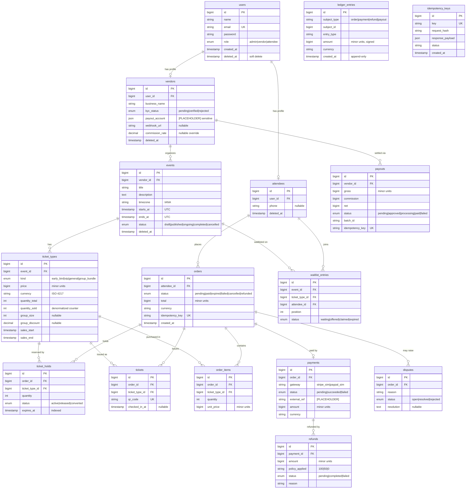

# EventHub — Entity Relationship Diagram

> **Graded deliverable** (part of Rubric 2). A starter ERD is seeded below to match the schema described in
> `services/core-api/CLAUDE.md` §F and `system-architecture.md`. Refine columns/types as migrations are written and
> keep this in sync. Renders on GitHub/GitLab and in Mermaid Live.

## ER diagram (Mermaid)

## Relationship notes
<!-- FILL: explain each non-obvious relationship and the integrity rules:
- users 1:1 vendors / attendees (role-specific profile).
- ticket_holds vs tickets: holds are transient reservations (15 min); tickets are issued only after payment succeeds.
- orders ↔ payments 1:1 (one charge per order) but payments ↔ refunds 1:N (partial refunds).
- ledger_entries is polymorphic + append-only — the financial source of truth.
- idempotency_keys guards money operations (also in payment-service's own DB).
- Why quantity_sold is denormalized on ticket_types (fast availability check under lock).
-->
